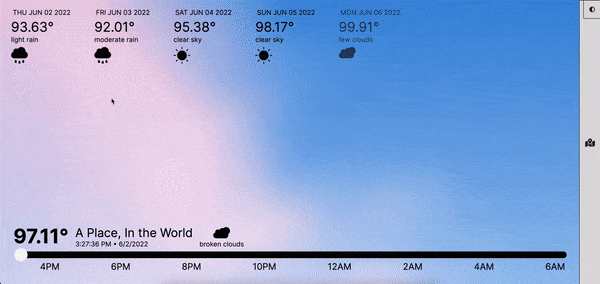

# Codeup Web Exercises

## About

HTML, CSS, and Javascript web exercises from my time at [codeup](https://codeup.com).

## Notable Projects

### Weather Map

#### Built With

- HTML
- CSS
- Javascript
- Jquery
- [Open Weather Map API](https://openweathermap.org)
- [Mapbox](https://www.mapbox.com)

#### Features

- Time slider allows user to view weather at specific times
- Background gradient + images update according to time of day
- User can set location through search or interactive [map](https://www.mapbox.com)
- Dynamic state management
- Component renders based on the application state change
- Components are animated in/out when they update, and before they die

### Konami Code

#### Built With

- HTML
- CSS
- Javascript
- Jquery

#### Features

- Javascript dynamically generates or transforms elements into "CRT" styled elements
- Pure CSS flicker and scanlines
- Splitting elements into RGB for [Chromatic Abberation](https://en.wikipedia.org/wiki/Chromatic_aberration) effect.
- Registers user input and updates component based on weather or not they are inputting
  the [Konami Code](https://en.wikipedia.org/wiki/Konami_Code) correctly

### Movies App

Movie app I built with [@ScottRoberts70](https://github.com/ScottRoberts70) as part of a paired programming project

#### Built With

- HTML
- CSS
- Javascript
- [TMDB API](https://developers.themoviedb.org/3)
- [Flickity](https://flickity.metafizzy.co/)

#### Features

- Fetches movie data from [TMDB API](https://developers.themoviedb.org/3) using native JS fetch API, then generates
  cards to be put into a [Flickity](https://flickity.metafizzy.co/) carousel.
- Display a modal when a movie is selected that gives more info.
- User can add/remove movies to and from their movie list 

